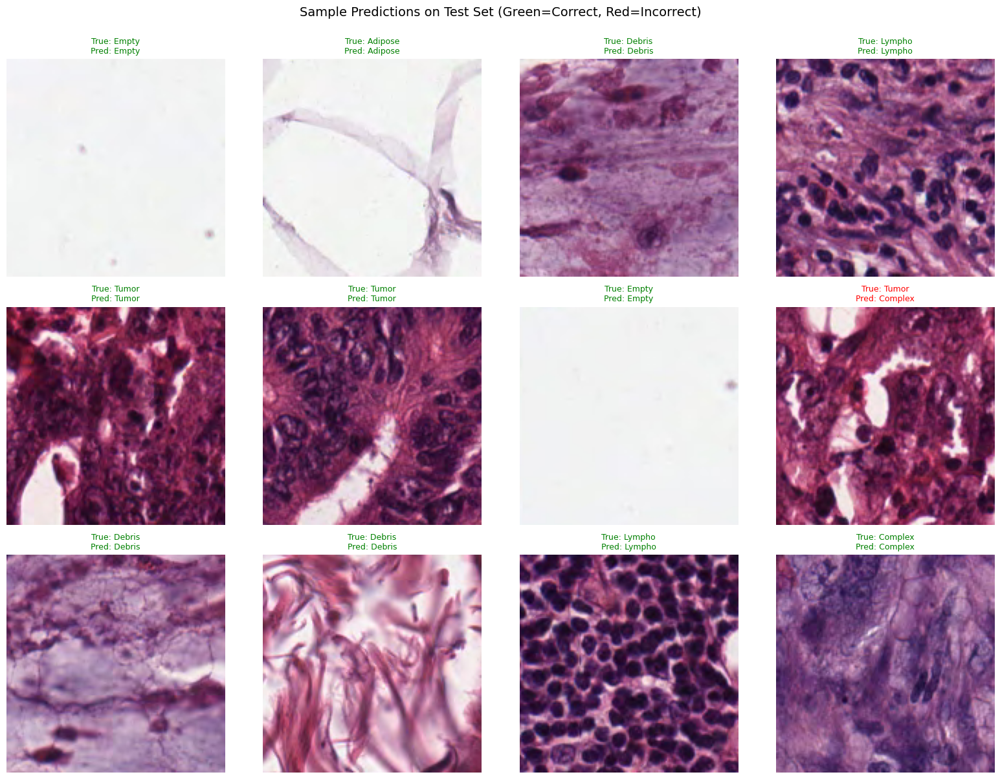

# Vision Transformer for Colorectal Histology Classification

Fine-tuned Vision Transformer (ViT) model for classifying colorectal histology images into 8 tissue types.

## 🎯 Model Description

This model is a fine-tuned version of [google/vit-base-patch16-224](https://huggingface.co/google/vit-base-patch16-224) on the [colorectal histology dataset](https://huggingface.co/datasets/dpdl-benchmark/colorectal_histology).

### Base Model
- **Architecture**: Vision Transformer (ViT)
- **Variant**: Base, Patch 16
- **Pre-training**: ImageNet-21k (14 million images, 21,843 classes)
- **Input Resolution**: 224×224 pixels
- **Parameters**: ~86M total

### Fine-tuning Task
Multi-class image classification for colorectal tissue types.

## 📊 Dataset

**Source**: [dpdl-benchmark/colorectal_histology](https://huggingface.co/datasets/dpdl-benchmark/colorectal_histology)

The dataset contains histological images of colorectal tissue samples classified into 8 categories:

| Class | Description |
|-------|-------------|
| **Tumor** | Cancerous tissue |
| **Stroma** | Connective tissue |
| **Complex** | Complex/mixed tissue patterns |
| **Lympho** | Lymphocytes (immune cells) |
| **Debris** | Cellular debris |
| **Mucosa** | Mucosal tissue |
| **Adipose** | Fat tissue |
| **Empty** | Empty/background regions |

### Data Split
- **Training**: 68% of the dataset (3400 samples)
- **Validation**: 16% of the dataset (800 samples) - for model selection
- **Test**: 16% of the dataset (800 samples) - for unbiased evaluation
- **Split Strategy**: Stratified (100 samples per class in val and test)
- **Final Model**: Retrained on 100% of data (5000 samples) for deployment

## 🚀 Training Details

### Hyperparameters
```python
Batch Size: 16
Epochs: 10
Learning Rate: 2e-4
Warmup Ratio: 0.1
Weight Decay: 0.01
Optimizer: AdamW
```

### Training Procedure
1. Load pre-trained ViT model from Hugging Face
2. Replace classification head (21,843 → 8 classes)
3. Split data: 68% train, 16% validation, 16% test
4. Fine-tune on training set (~3400 samples)
5. Use validation set for early stopping/model selection
6. Evaluate on test set for unbiased metrics
7. Save validated model with test metrics
8. Retrain on 100% of data (5000 samples) for deployment
9. Save deployment model for production use

## 📈 Performance

### Test Set Metrics (Unbiased Evaluation)
<!-- Metrics from test set (16% of data, never used during training) -->
```
Accuracy:  0.9587
Precision: 0.9618
Recall:    0.9587
F1 Score:  0.9594
```

**Note**: These metrics are from the test set which was completely held out during training. The validation set was used for model selection (early stopping), while the test set provides truly unbiased performance estimates.

### Sample Predictions


*Sample predictions on validation set. Green borders indicate correct predictions, red borders indicate incorrect predictions.*

<!-- You can manually replace sample_predictions.png with your actual image -->

## 💻 Usage

### Load Model from Hugging Face

```python
from transformers import ViTImageProcessor, ViTForImageClassification
from PIL import Image
import torch

# Load model and processor
# Use the deployment model (trained on 100% of data) for best performance
model_name = "YOUR-USERNAME/vit-colorectal-histology"  # Replace with your model path
processor = ViTImageProcessor.from_pretrained(model_name)
model = ViTForImageClassification.from_pretrained(model_name)

# Set to evaluation mode
model.eval()
device = torch.device("cuda" if torch.cuda.is_available() else "cpu")
model.to(device)

# Load and preprocess image
image = Image.open("path/to/your/image.png").convert("RGB")
inputs = processor(images=image, return_tensors="pt")
inputs = {k: v.to(device) for k, v in inputs.items()}

# Make prediction
with torch.no_grad():
    outputs = model(**inputs)
    logits = outputs.logits
    probabilities = torch.nn.functional.softmax(logits, dim=-1)
    predicted_class_idx = probabilities.argmax(-1).item()
    confidence = probabilities[0, predicted_class_idx].item()

# Get predicted label
id2label = model.config.id2label
predicted_label = id2label[predicted_class_idx]

print(f"Predicted: {predicted_label} (Confidence: {confidence:.2%})")
```

### Quick Inference Function

```python
def predict_tissue_type(image_path, model, processor, device):
    """
    Predict tissue type from histology image.
    
    Args:
        image_path: Path to the image file
        model: Fine-tuned ViT model
        processor: ViT image processor
        device: torch device (cuda/cpu)
    
    Returns:
        predicted_label: Predicted tissue type
        confidence: Confidence score (0-1)
    """
    from PIL import Image
    import torch
    
    # Load and preprocess image
    image = Image.open(image_path).convert("RGB")
    inputs = processor(images=image, return_tensors="pt")
    inputs = {k: v.to(device) for k, v in inputs.items()}
    
    # Predict
    model.eval()
    with torch.no_grad():
        outputs = model(**inputs)
        probabilities = torch.nn.functional.softmax(outputs.logits, dim=-1)
        predicted_class_idx = probabilities.argmax(-1).item()
        confidence = probabilities[0, predicted_class_idx].item()
    
    predicted_label = model.config.id2label[predicted_class_idx]
    return predicted_label, confidence

# Example usage
label, conf = predict_tissue_type("tissue.png", model, processor, device)
print(f"{label}: {conf:.2%}")
```

## 🔄 Model Training Methodology

This project uses a two-stage training approach:

### Stage 1: Validation and Evaluation
- **Training Data**: 68% of dataset (3400 samples)
- **Validation Set**: 16% (800 samples) - used for model selection
- **Test Set**: 16% (800 samples) - held out for unbiased evaluation
- **Purpose**: Obtain unbiased performance metrics
- **Metrics**: Test set provides truly unbiased performance estimates (100 samples per class)

### Stage 2: Final Model Training
- **Training Data**: 100% of dataset (5000 samples)
- **Purpose**: Production deployment with maximum performance
- **Use Case**: Hugging Face Hub, inference, Gradio app
- **Performance Reference**: Use Stage 1's test metrics for reporting

**Methodology**: First, we train on 68% of data and validate on held-out test set to get unbiased metrics. Then, we retrain on all available data to maximize final model performance for deployment.

## 🎨 Try it Online

Try the model in an interactive demo: [Hugging Face Space](https://huggingface.co/spaces/YOUR-USERNAME/vit-colorectal-histology)

*The online demo uses the deployment model trained on 100% of the data.*

## 📁 Repository Structure

```
.
├── README.md                   # This file
├── vit_finetuning.ipynb       # Complete training pipeline notebook
└── huggingface_space/         # Gradio app for HF Spaces
    ├── app.py                 # Main application
    ├── requirements.txt       # Python dependencies
    └── extract_examples.py    # Script to extract example images
```

**Note**: Trained model files are not included in this repository. The final model is available on [Hugging Face Hub](https://huggingface.co/shulik7/vit-colorectal-histology).

## 🛠️ Requirements

```
transformers>=4.30.0
torch>=2.0.0
torchvision>=0.15.0
pillow>=9.0.0
datasets>=2.14.0
scikit-learn>=1.3.0
matplotlib>=3.7.0
seaborn>=0.12.0
accelerate>=0.20.0
evaluate>=0.4.0
```

## 📝 Citation

If you use this model, please cite:

```bibtex
@misc{vit-colorectal-histology,
  author = {Shuli Kang},
  title = {Vision Transformer for Colorectal Histology Classification},
  year = {2025},
  publisher = {Hugging Face},
  howpublished = {\url{https://huggingface.co/shulik7/vit-colorectal-histology}}
}
```

### Base Model Citation

```bibtex
@article{dosovitskiy2020image,
  title={An Image is Worth 16x16 Words: Transformers for Image Recognition at Scale},
  author={Dosovitskiy, Alexey and Beyer, Lucas and Kolesnikov, Alexander and Weissenborn, Dirk and Zhai, Xiaohua and Unterthiner, Thomas and Dehghani, Mostafa and Minderer, Matthias and Heigold, Georg and Gelly, Sylvain and others},
  journal={ICLR},
  year={2021}
}
```

### Dataset Citation

```bibtex
@article{kather2016multi,
  title={Multi-class texture analysis in colorectal cancer histology},
  author={Kather, Jakob Nikolas and Weis, Cleo-Aron and Bianconi, Francesco and Melchers, Susanne M and Schad, Lothar R and Gaiser, Timo and Marx, Alexander and Z{\"o}llner, Frank Gerrit},
  journal={Scientific Reports},
  volume={6},
  pages={27988},
  year={2016},
  publisher={Nature Publishing Group}
}
```

## 📄 License

This model is released under the same license as the base model (Apache 2.0).

## 🤝 Contributing

Contributions, issues, and feature requests are welcome!

## 👤 Author

**Shuli Kang**
- GitHub: [shulik7](https://github.com/shulik7)
- Hugging Face: [shulik7](https://huggingface.co/shulik7)
- LinkedIn: [shulik](https://www.linkedin.com/in/shulik/)
  
## 🙏 Acknowledgments

- Google Research for the pre-trained ViT model
- The colorectal histology dataset authors
- Hugging Face for the transformers library
